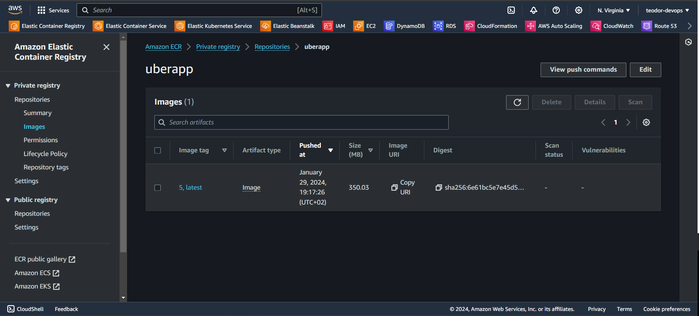
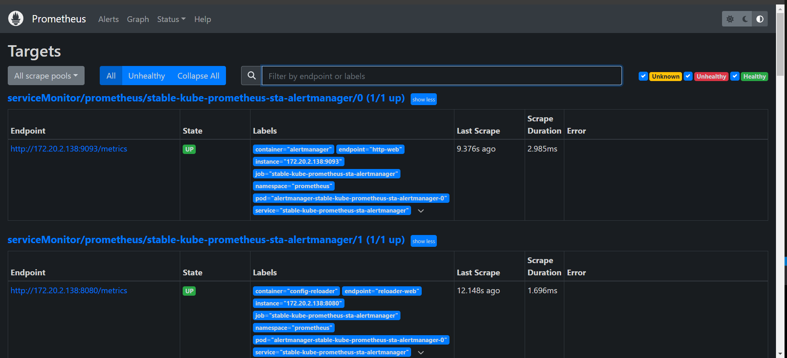

# **DevSecOps Mastery: Jenkins CI/CD for Uber Clone with Monitoring**
This comprehensive project focuses on deploying an Uber Clone. Leveraging Jenkins as our CI/CD tool, we'll deploy the application on Amazon ECR and EKS. Furthermore, we'll employ Prometheus and Grafana to monitor Kubernetes metrics. Dive into the project and enjoy the journey!

## **Architecture**


## **Prerequisites**

- [x]  AWS Account created
- [x]  Terraform installed on your local machine
- [x]  Code editor of your choice (VSCode, Sublime, etc.)
- [x]  GitBash installed


# **Let's dive into the project**

## **Part 1: Clone the code locally in your terminal**

```sh
git clone https://github.com/teodor1006/UberClone-CICD.git
``` 

## **Part 2: Create an IAM User & Configure AWS CLI**

### **Step 1: Create IAM User**

* Open the AWS Management Console and sign in with your AWS account.

* Navigate to the IAM dashboard.

* In the left sidebar, click on "Users" and then click the "Add user" button.

* Enter a username, check "Programmatic access" for AWS CLI, and click "Next: Permissions."

* Choose "Attach existing policies directly" and select:

```
AdministratorAccess
AmazonEC2ContainerRegistryFullAccess
```

* Review your choices and click "Create user."

* On the user details page, go to the "Security credentials" tab.

* Under the "Access keys" section, click "Create access key."

* Download the CSV file containing the access key ID and secret access key. Keep this file secure as it will not be accessible again.

### **Step 2: Configure AWS CLI**

* Open a terminal or command prompt (In my case gitbash).

* Run the following command:

```sh
aws configure
```

* Enter the IAM user's access key ID & secret access key from the stored CSV File, default region and output format when prompted.

```sh
AWS Access Key ID [None]: <YOUR_ACCESS_KEY_ID>
AWS Secret Access Key [None]: <YOUR_SECRET_ACCESS_KEY>
Default region name [None]: us-east-1
Default output format [None]: json
```

* AWS CLI is now configured with the IAM user credentials.

## **Part 3: Create a Jenkins EC2 Instance (t2.large) with Terraform**

* Make sure to create a key pair (If you use another key pair, make sure to change the name in `main.tf` file)
* Open the the `JENKINS-Terraform` folder and put the following commands:

```sh
cd Jenkins-Terraform/
```
```sh
terraform init
terraform validate
terraform plan
terraform apply -auto-approve
```


* We have installed the following with the Jenkins EC2 Instance: `Jenkins`, `Docker`, `Trivy`, `kubectl`, `AWS CLi`.

* Copy the public Ipv4 address of your EC2 Instance and connect to it.

```sh
ssh -i <your key pair path> ubuntu@<your ipv4 address>
```
* Check if the tools are already installed

```sh
jenkins --version
docker --version
trivy --version
aws --version
kubectl --version
```

## **Part 4: Connect to Jenkins and SonarQube**

### **Step 1: Access Jenkins Web UI**

* Copy the Ipv4 address of your instance and paste it into the browser

```sh
<EC2-Ipv4:8080>
```


```sh
sudo cat /var/lib/jenkins/secrets/initialAdminPassword
```
* Copy the password and paste it into the Jenkins web UI to unlock and proceed with the setup.

* Install the suggested plugins.


* Create first admin user, click on save and continue.


* Now you can see the Jenkins Dashboard.


### **Step 2: Access SonarQube Web UI**

* Open your web browser and navigate to http://your-ec2-public-ip:9000. The default login credentials are:

```sh
Username: admin
Password: admin
```
* Change the password after logging in for the first time.

### **Step 3: Install neccessary Plugins for Jenkins**

* Navigate to your Jenkins Dashboard

* Go to Manage Jenkins -> Plugins -> Available Plugins and Install the following ones:

```sh
Eclipse Temurin Installer
SonarQube Scanner
NodeJs Plugin
OWASP Dependency-Check
Docker
Docker Pipeline
AWS Credentials
Amazon ECR
SlackNotification
Kubernetes Credentials
Kubernetes Check API
Kubernetes
Kubernetes CLI
```

### **Step 4: Configure Java and Nodejs in Jenkins**

* Go to Manage Jenkins -> Tools -> JDK Installations and install the following:

```sh
Name: jdk17
Install from adoptium.net
Version: jdk17-17.0.8.1+1
```

* Go also to NodeJS Installations and install the following:

```sh
Name: node16
Install from nodejs.org
Version: NodeJS 16.2.0
```
Click on Apply and Save.

### **Step 5: Configure SonarQube Server in Jenkins**

* Go to your SonarQube Server

* Click on Administration -> Security -> Users -> Tokens and Update Token -> Give it a Name and Generate Token

* Copy the generated token

* Go to Jenkins Dashboard -> Manage Jenkins -> Credentials -> System:

```sh
Kind: Secret text
Scope: Global
Secret: <your generated token>
ID: Sonar-token
Description: Sonar-token
```
Click on Create.

* Now, go to Dashboard -> Manage Jenkins -> System and add the following in "SonarQube installations":

```sh
Name: sonar-server
Server URL: <http://your-ec2-public-ip:9000>
Server authentication token: Sonar-token
```

* Go to your Dashboard -> Manage Jenkins -> Tools -> SonarQube Scanner installations

```sh
Name: sonar-scanner
Install automatically from Maven Central
Version: SonarQube Scanner 5.0.1.3006
```

* Now go to your SonarQube Dashboard -> Administration -> Configuration -> Webhooks -> Click on Create

```sh
Name: jenkins
URL: <http://your-ec2-public-ip:8080>/sonarqube-webhook/
```

### **Step 6: Configure OWASP Dependency-Check Plugin in Jenkins**

* Go to Dashboard -> Manage Jenkins -> Tools -> Dependency-Check installations

```sh
Name: DP
Install automatically from github.com
Version: dependency-check 6.5.1
```
Click on Apply and Save.

### **Step 6: Configure Docker Plugin in Jenkins**

* Go to Dashboard -> Manage Jenkins -> Tools -> Docker installations

```sh
Name: docker
Install automatically from docker.com
Docker version: latest
```
Click on Apply and Save.

## **Part 4: Configure AWS credentials in Jenkins**

* Open your Jenkins dashboard and click on "Manage Jenkins" > "Manage Credentials".
* Under the "(global)" domain, click on "(Add Credentials)":

```sh
Kind: Choose "AWS Credentials" from the dropdown.
Access Key ID and Secret Access Key: Enter the credentials from your IAM User
```

* Click "OK" to save the credentials.

## **Part 5: Configure Slack for Notifications**

### **Step 1: Create a Slack Account and a channel named `jenkins-cicd`**

### **Step 2: Install the `Jenkins CI` app on Slack**

* Go to Slack, click on your name, select settings and administration.
* Click on "Manage apps" -> Search for Jenkins CI -> Click on "Add to Slack."
* Choose your Slack channel, click on "Add Jenkins CI integration."
* Follow the setup instructions, and copy the `team subdomain` and `integration token credential ID` for later use.

### **Step 3: Configure Slack in Jenkins**

* Ensure the Slack Notification Plugin is installed.
* Click on Manage Jenkins -> Credentials -> Global, select kind as Secret text. 
* Provide your Slack token in the secret section; ID and description are optional. Click on create.


* After that click on Manage Jenkins -> System. 
* Scroll to the end of the page: 

```sh
Workspace: -> team subdomain
Credential: -> your credential for slack
Default channel: -> provide your channel name
```
* Click on "Test Connection" to ensure a successful connection.
* Apply and Save.
* You will receive a notification in Slack.


## **Part 6: Create S3 Bucket and ECR Repository**

### **Step 1: Create an S3 Bucket**

* In the AWS Management Console, search for `S3` in the Find Services search bar.
* Click the "Create bucket" button.
* Enter a globally unique name for your bucket in the "Bucket name" field (e.g., uberclone-terrastate).
* Keep the rest as default -> Click "Create bucket".

### **Step 2: Create an ECR Repository**

* In the AWS Management Console, search for "ECR" under "Containers" in the Find Services search bar.
* In the Amazon ECR console, click the "Get Started" button -> Click "Create repository".
* Enter a name for your repository in the "Repository name" field (e.g., uberapp).
* Click "Create repository".

## **Part 7: Provision an EKS Cluster with Terraform**

* Open the the `EKS-Terraform` folder in your terminal and put the following commands:

```sh
terraform init
terraform fmt -check
terraform validate
terraform plan -out planfile
terraform apply -auto-approve -input=false -parallelism=1 planfile
```
* Wait about 10 minutes for starting the cluster


## **Part 8: Get the Kubernetes Certificate**

* Go to your Jenkins EC2 Instance SSH and enter the following:

```sh
aws eks update-kubeconfig --name <Cluster Name> --region <Cluster Region>
```
* After that paste also that:

```sh
cat ~/.kube/config
```
* Copy the whole output and save it as a text file (e.g., secretfile.txt)

* Go to your Jenkins Dashboard -> Manage Jenkins -> Manage credentials -> Jenkins global -> Add Credentials

```sh
Kind: Secret file
Scope: Global
File: upload your `secretfile.txt`
ID: k8s
Description (optional): k8s
```
* Click on create.

## **Part 9: Store some environment variables in Jenkins**

* Open your Jenkins Dashboard -> Manage Jenkins -> Configure System -> Global properties -> Click on Environment variables
* We will store 3 environment variables: `registryCredential`, `appRegistry`, `uberRegistry`.
* The variables should look like that: 

```sh
registryCredential: ecr:us-east-1:awscreds
appRegistry: <AWSAccountID>.dkr.ecr.us-east-1.amazonaws.com/uberapp
uberRegistry: https://<AWSAccountID>.dkr.ecr.us-east-1.amazonaws.com
```
* Click add and save.

## **Part 10: Define the Jenkins pipeline, which is stored in Jenkinsfile**

```sh
def COLOR_MAP = [
    'SUCCESS': 'good',
    'FAILURE': 'danger'
]

pipeline {
    agent any
    tools {
        jdk 'jdk17'
        nodejs 'node16'
    }
    environment {
        SCANNER_HOME = tool 'sonar-scanner'
    }

    stages {
        stage('Git Checkout') {
            steps {
                checkout scm
            }
        }

        stage('Static Code Analysis') {
            steps {
                withSonarQubeEnv('sonar-server') {
                    sh "$SCANNER_HOME/bin/sonar-scanner -Dsonar.projectName=Uber -Dsonar.projectKey=Uber"
                }
            }
        }

        stage('Quality Gate') {
            steps {
                waitForQualityGate abortPipeline: false, credentialsId: 'Sonar-token'
            }
        }

        stage('Install Dependencies') {
            steps {
                sh "npm install"
            }
        }

        stage('OWASP FS SCAN') {
            steps {
                dependencyCheck additionalArguments: '--scan ./ --disableYarnAudit --disableNodeAudit', odcInstallation: 'DP'
                dependencyCheckPublisher pattern: '**/dependency-check-report.xml'
            }
        }

        stage('TRIVY FS SCAN') {
            steps {
                sh "trivy fs . > trivyfs.txt"
            }
        }

        stage('Build and Push Docker Image to ECR') {
            steps {
                script {
                    dockerImage = docker.build("${appRegistry}:${BUILD_NUMBER}", "./")
                    docker.withRegistry(uberRegistry, registryCredential) {
                        dockerImage.push("${BUILD_NUMBER}")
                        dockerImage.push('latest')
                    }
                }
            }
        }

        stage('Container Security Scan') {
            steps {
                sh "trivy image ${appRegistry}:${BUILD_NUMBER} > trivy_image.txt"
            }
        }

        stage('Deploy to EKS'){
            steps{
                script{
                        withKubeConfig(caCertificate: '', clusterName: '', contextName: '', credentialsId: 'k8s', namespace: '', restrictKubeConfigAccess: false, serverUrl: '') {
                                sh 'kubectl apply -f deployment.yaml'
                                sh 'kubectl apply -f service.yaml'
                    }
                }
            }
        }
    }

    post {
        always {
            slackSend (
                channel: '#jenkins-cicd',
                color: COLOR_MAP[currentBuild.currentResult],
                message: "*${currentBuild.currentResult}:* Job ${env.JOB_NAME} \n build ${env.BUILD_NUMBER} \n More info at: ${env.BUILD_URL}"
            )
        }
    }
}
```

## **Part 11: Build the pipeline**

* Go to your Jenkins Dashboard -> Create job -> Pipeline -> Give it a name (e.g., uber-pipe)


```sh
Pipeline from SCM
Git
URL: <url from your github repo>
Branch: */main
path: Jenkinsfile
```
* Click on Build Now.


* The image is stored in ECR Repo


* The OWASP Depedency Check Results


* The Slack Notification after executing the pipeline


* Open your AWS Management Console -> EC2 -> Load Balancers
* Click on it, copy the DNS name and paste it in your browser.


## **Part 12: Monitoring with Prometheus and Grafana**

### **Step 1: Setup an AWS `t2.medium` Ubuntu EC2 Instance**

* Name it as `monitoring`. Create a new keypair, and enable HTTP and HTTPS Traffic for the Security Group.
* Launch the instance and connect to it using ssh. 
* Configure `AWS CLI` using the below commands:

```sh
# Install AWS CLI
curl "https://awscli.amazonaws.com/awscli-exe-linux-x86_64.zip" -o "awscliv2.zip"
sudo apt-get install unzip -y
unzip awscliv2.zip
sudo ./aws/install
aws --version
```
* Now type in the terminal `aws configure` and configure the user that you have created in Step 2.

* Install and setup `kubectl`

```sh
sudo apt update
sudo apt install curl -y
curl -LO https://dl.k8s.io/release/$(curl -L -s https://dl.k8s.io/release/stable.txt)/bin/linux/amd64/kubectl
sudo install -o root -g root -m 0755 kubectl /usr/local/bin/kubectl
kubectl version --client
```

* Install and setup `eksctl`

```sh
curl --silent --location "https://github.com/weaveworks/eksctl/releases/latest/download/eksctl_$(uname -s)_amd64.tar.gz" | tar xz -C /tmp
sudo mv /tmp/eksctl /usr/local/bin
eksctl version
```

* Install Helm Chart

```sh
curl https://baltocdn.com/helm/signing.asc | gpg --dearmor | sudo tee /usr/share/keyrings/helm.gpg > /dev/null
sudo apt-get install apt-transport-https --yes
echo "deb [arch=$(dpkg --print-architecture) signed-by=/usr/share/keyrings/helm.gpg] https://baltocdn.com/helm/stable/debian/ all main" | sudo tee /etc/apt/sources.list.d/helm-stable-debian.list
sudo apt-get update
sudo apt-get install helm
helm version
```

### **Step 2: Configure kube config**

* Update Kube config by entering below command:

```sh
aws eks update-kubeconfig --name <Cluster Name> --region <Cluster Region>
```

* To view the list of worker nodes as part of EKS cluster, type:

```sh
kubectl get nodes
kubectl get ns
```

### **Step 3: Configure Prometheus and Grafana**

```sh
helm repo add stable https://charts.helm.sh/stable
helm repo add prometheus-community https://prometheus-community.github.io/helm-charts
kubectl create namespace prometheus
helm install stable prometheus-community/kube-prometheus-stack -n prometheus
```
* The helm repo kube-stack-Prometheus comes with a Grafana deployment embedded (as the default one).
* To check whether Prometheus is installed or not use the below command:

```sh
kubectl get pods -n prometheus
```
* To check the services file (svc) of the Prometheus:

```sh
kubectl get svc -n prometheus
```
->> Grafana will be coming along with Prometheus as the stable version. 

* Now lets expose Prometheus and Grafana through `Load Balancer` instead of `ClusterIP`

```sh
kubectl edit svc stable-kube-prometheus-sta-prometheus -n prometheus
```


* Change it from Cluster IP to LoadBalancer after that make sure you save the file (:wq!)

```sh
kubectl get svc -n prometheus
```


* Grab the Load Balancer Link and paste it in your browser with port 9090




* Let’s change the SVC file of the Grafana and expose it to the outer world

```sh
kubectl edit svc stable-grafana -n prometheus
```
* Change it from Cluster IP to LoadBalancer after that make sure you save the file (:wq!)

```sh
kubectl get svc -n prometheus
```


* Use the link of the LoadBalancer and access it from the Browser


* The username is `admin` and also use this command to get the password:

```sh
kubectl get secret --namespace prometheus stable-grafana -o jsonpath="{.data.admin-password}" | base64 --decode ; echo
```
* Create a Dashboard in Grafana by clicking on `Import` -> `Import dashboard`

```sh
Support via grafana.com: 15760 Load
Use Prometheus
```
* Click on Import.


* You can see the entire data of the EKS cluster such as: CPU, RAM , Pods in a specific namespace, Pod up history, HPA, Resources by Container, CPU used by container & limits, Network Bandwidth & Packet Rate, etc.

## **Part 13: CleanUp**

* Terminate your `Monitoring` EC2 Instance in your AWS Account.

* Open your `Jenkins-Terraform` folder and type:

```sh
terraform destroy -auto-approve
```
* Open your `EKS-Terraform` folder and type:

```sh
terraform destroy -auto-approve
```
* After the terraform files got deleted, delete also your ECR Repo and S3 Bucket.


